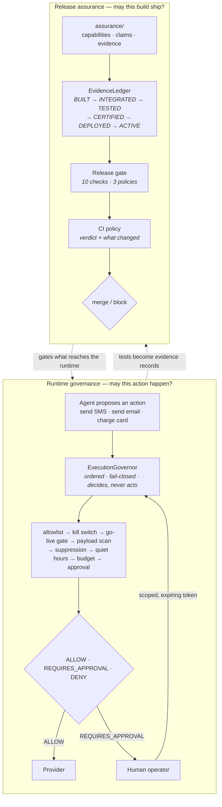

# StormBot

**An AI agent that can spend your money and text your customers needs two things
that most agent frameworks don't have: something that decides whether an action
is permitted, and something that decides whether a claim about the system is
true.**

This repository is a working reference implementation of both.

[](https://github.com/StormResourseAI/stormbot/actions/workflows/ci.yml)
[](https://github.com/StormResourseAI/stormbot/actions/workflows/release-assurance.yml)
[](pyproject.toml)
[](LICENSE)
[](pyproject.toml)

---

## Start here

| If you have | Read |
| --- | --- |
| 60 seconds | [The idea worth stealing](#the-idea-worth-stealing), below |
| 15 minutes | [`docs/REVIEWER_GUIDE.md`](docs/REVIEWER_GUIDE.md) — a guided path through the code |
| an afternoon | [`docs/architecture/ARCHITECTURE.md`](docs/architecture/ARCHITECTURE.md) and the [ADRs](docs/adr/) |

---

## The idea worth stealing

Marketing pages make claims. "An operator approves every message before it
sends." "Once someone opts out, we never contact them again." Those sentences are
assertions about program behaviour, but they live in a CMS, and nothing checks
them.

So put them in the repository instead:

```json
{
  "id": "claim.opt_out_is_enforced",
  "statement": "Once someone opts out, the system will not contact them again, regardless of how their phone number or email address is formatted on a later import.",
  "customer_facing": true,
  "capability_refs": ["governance.contact_suppression", "governance.execution_governor"],
  "evidence_refs": ["ev.contact_suppression.tests", "ev.execution_governor.tests"],
  "required_state": "TESTED",
  "status": "active"
}
```

Every push, CI resolves each claim against an evidence ledger and refuses the
build when a claim outruns what the evidence supports. Delete the test that
proves opt-out survives reformatting, and the build fails on
`claim-evidence-sufficiency` — not because a test went missing, but because a
promise stopped being true.

That is the whole thesis: **claims about an AI system should be
machine-checkable artifacts, gated in CI, on the same footing as types.**

---

## What this repository is

A clean-room reference implementation, written for publication, of the safety and
assurance patterns behind a private revenue-automation system. It is real,
runnable code with a real test suite and real CI — not pseudocode, and not the
production system.

| | |
| --- | --- |
| **Runtime dependencies** | 0 — standard library only, [enforced by a test](tests/contract/test_hermeticity.py) |
| **Source** | 2,374 lines across 13 modules |
| **Tests** | 141 test functions across 14 modules, 2,074 lines |
| **Full suite runtime** | ~0.15s, no network, no database, no fixtures directory |
| **Relationship to production** | Patterns reimplemented from scratch; no production code, data, history, or configuration was copied |

Nothing here contains credentials, customer data, lead records, database
contents, logs, or backups. That is not a promise in a paragraph —
[`tests/contract/test_repository_hygiene.py`](tests/contract/test_repository_hygiene.py)
fails the build if a credential-shaped string, a phone number outside the
reserved `555-01xx` fictional block, or a non-`example.com` email address appears
anywhere in the tree.

---

## The two halves



The dotted lines are the point. The runtime controls are what the product claims
about itself; the assurance pipeline is what stops those claims from drifting
away from the code.

---

## Half one: governed execution

An agent that can text a stranger needs one place where "may I do this?" is
answered. Scattering the checks across call sites guarantees that some future
call site is missing one.

[`ExecutionGovernor`](src/stormbot/governance/governor.py) owns the entire
pipeline and returns a decision. **Nothing in that module can send anything.**

```python
decision = governor.evaluate(
    ActionRequest(
        action_type="outreach.send_sms",
        actor="agent.outreach",
        target="+18135550142",
        payload="Following up on your roof estimate - Thursday still work?",
        requested_at=now,
    )
)
# Verdict.REQUIRES_APPROVAL — the agent cannot mint its own approval
```

Four design rules, each with a test that would fail if it were violated:

| Rule | Why | Test |
| --- | --- | --- |
| **Default deny** | An action type nobody put on the allowlist is denied. New capabilities arrive by policy edit, not by shipping a tool. | `test_unknown_action_type_is_denied` |
| **Decide, don't act** | The governor returns a verdict. It holds no provider client and has no send path. | structural |
| **Run every check** | No short-circuit on the first block, because an operator debugging a denial needs the whole trail. | `test_every_check_appears_in_the_trail_even_after_a_block` |
| **An exception is a denial** | A check that raises has not passed. There is no path from an error to an allow. | `test_a_check_that_raises_denies_rather_than_allows` |

Three supporting controls are worth their own look:

- **[Scoped approval tokens](src/stormbot/governance/approvals.py)** — an approval
  is HMAC-signed over one action type, one target digest, and one expiry. A
  boolean `approved=True` on a request is not an approval, because the agent can
  set it. A token issued for Dana cannot be replayed against Marco.
- **[Keyed-digest suppression](src/stormbot/governance/suppression.py)** — the
  do-not-contact list stores HMAC digests, never phone numbers. Membership tests
  still work; a leaked file is not a marketing list. `(813) 555-0142` and
  `+18135550142` resolve to the same key, so an opt-out survives a reformatted
  CRM export.
- **[Egress redaction](src/stormbot/governance/redaction.py)** — outbound content
  is scanned for credential shapes before it reaches a provider, a log, or a
  model prompt. Findings carry detector names and offsets, never the matched
  value, because findings end up in CI logs.

See it run: `PYTHONPATH=src python3 examples/governed_send.py`

---

## Half two: release assurance

Run the gate against this repository:

```console
$ make gate

release gate: PASS
policy=deployment target=HEAD compare_to=-

[PASS] registry-schema (blocking) — 3 registry files validate
[PASS] capability-refs-resolve (blocking) — 7 claims reference known capabilities
[PASS] evidence-refs-resolve (blocking) — 24 evidence records referenced cleanly
[PASS] claim-evidence-sufficiency (blocking) — all active claims are backed by sufficient evidence
[PASS] customer-facing-floor (blocking) — customer-facing claims meet the TESTED floor
[PASS] declared-state-honesty (blocking) — declared states match the evidence ledger
[PASS] hitl-approval-gate (blocking) — every human-in-the-loop capability names an approval gate
[PASS] no-blocked-capabilities (blocking) — no active claim depends on a blocked capability
[PASS] review-recency (advisory) — every registry entry has a recent review
[PASS] orphan-capabilities (advisory) — no orphaned capabilities

10 passed, 0 warned, 0 failed
```

Now run the strictest policy — `make certify` — and it **fails**, on purpose:

```console
release gate: FAIL
[FAIL] customer-facing-floor (blocking) — customer-facing claims below the CERTIFIED floor (11)
```

Nothing here is `CERTIFIED`, because certification requires evidence bound to an
exact commit SHA and no such record exists. A gate that only ever passes is
decoration. This one has a policy it currently cannot satisfy, and says so.

### Why the ledger, and not a status field

The [evidence ladder](docs/assurance/EVIDENCE_STATES.md) exists because "done"
collapses six different conditions into one word:

```
BUILT → INTEGRATED → TESTED → CERTIFIED → DEPLOYED → ACTIVE
```

A subject's state is the highest rung for which *every rung below it* also has
evidence. Certification evidence with no test evidence proves nothing above
`BUILT`. Runtime evidence expires after 24 hours, because `ACTIVE` is a claim
about the present tense; source evidence does not expire, because a passing test
run is a fact about a revision, not about a date.

Critically, the registry cannot promote itself. A capability declaring
`evidence_state: "ACTIVE"` with only test evidence fails
`declared-state-honesty`.

### Exit codes are part of the contract

| Code | Meaning |
| --- | --- |
| `0` | pass |
| `1` | warn — advisory findings only |
| `2` | fail — at least one blocking violation |
| `>2` | **the gate itself failed to run — this is not a verdict** |

That last row is why [the workflow](.github/workflows/release-assurance.yml)
handles the exit code explicitly instead of relying on `set -e`. A crashed gate
must never be readable as a policy answer.

### Merge policy is a separate question

"Is the registry consistent?" is not "should this PR merge?", and conflating them
produces a gate that is too loud on a typo fix and too quiet on a change to the
code that decides whether to text a stranger. So
[`ci_policy`](src/stormbot/assurance/ci_policy.py) reads the verdict *and* the
changed-file set:

- A failing gate blocks, always.
- Advisory findings block only when the change touches governed surface.
- **A change to safety-critical code with no accompanying test change blocks,
  even on a green gate.**

See it run: `PYTHONPATH=src python3 examples/release_gate_walkthrough.py`

---

## What CI actually does

Three workflows, and this section states their scope precisely rather than
implying more:

| Workflow | Scope |
| --- | --- |
| [`ci.yml`](.github/workflows/ci.yml) | Full suite on Python 3.11 / 3.12 / 3.13, byte-compile gate, hash-verified `ruff` lint, and repository hygiene as its own named check |
| [`release-assurance.yml`](.github/workflows/release-assurance.yml) | Seven parallel lanes, then a candidate-release-certification job that resolves a comparison base, runs the gate, uploads the report as an artifact, and applies the merge policy |
| [`lockfile-check.yml`](.github/workflows/lockfile-check.yml) | Drift between `requirements/dev.in` and both platform lockfiles, plus a real `--require-hashes` install on Linux and macOS |

**In this repository, "CI is green" means the entire test suite ran.** There are
141 test functions and CI runs all of them, on three interpreters. That is a
claim this repository can make because it is small. It is not a claim every
repository can make, and [`docs/PRODUCTION_EVIDENCE.md`](docs/PRODUCTION_EVIDENCE.md)
is explicit about where the private system's CI coverage is narrower than its
test suite.

Supply chain: development tooling is pinned by exact version *and* SHA-256 digest
in platform-split lockfiles, installed with `pip install --require-hashes`. A
substituted wheel fails the install rather than running. The runtime itself has
no dependencies to pin.

---

## Reviewing this repository

The fastest honest read is the tests that would fail if the safety properties
were untrue:

```console
git clone https://github.com/StormResourseAI/stormbot.git && cd stormbot
make test     # 141 tests, ~0.15s, no dependencies to install
make gate     # release gate under the deployment policy
make certify  # the strictest policy, which fails by design
make audit    # lockfile drift check
```

Then read, in this order:

1. [`src/stormbot/governance/governor.py`](src/stormbot/governance/governor.py) —
   the decision pipeline, 335 lines
2. [`tests/governance/test_execution_governor.py`](tests/governance/test_execution_governor.py) —
   the negative assertions
3. [`src/stormbot/assurance/release_gate.py`](src/stormbot/assurance/release_gate.py) —
   the ten checks
4. [`assurance/product_claims.json`](assurance/product_claims.json) — what the
   system says about itself

[`docs/REVIEWER_GUIDE.md`](docs/REVIEWER_GUIDE.md) expands this into a 15-minute
path with the specific questions to ask at each stop.

---

## Repository map

```
src/stormbot/
  governance/     governor · approvals · suppression · redaction · db_guard
  assurance/      evidence ledger · schema validator · registry · release gate · ci policy
assurance/
  ai_capabilities.json     what the system can do, and at what risk tier
  product_claims.json      what the system says about itself
  evidence/                dated proof, per capability
  schemas/                 JSON Schemas for all of the above
tests/
  governance/     unit contracts for each runtime control
  assurance/      unit contracts for the gate and the ledger
  integration/    the two pipelines, end to end
  contract/       hermeticity and repository hygiene
examples/         two runnable walkthroughs
requirements/     pins plus hash-locked, platform-split lockfiles
docs/
  REVIEWER_GUIDE.md · PRODUCTION_EVIDENCE.md
  architecture/ · assurance/ · security/ · operations/ · adr/
```

---

## Documentation

| | |
| --- | --- |
| [Reviewer guide](docs/REVIEWER_GUIDE.md) | A 15-minute guided path, with the question each file answers |
| [Architecture](docs/architecture/ARCHITECTURE.md) | Layering, data flow, and the boundaries that are load-bearing |
| [Governed execution](docs/architecture/GOVERNED_EXECUTION.md) | The decision pipeline check by check, and why the order matters |
| [Release assurance](docs/assurance/RELEASE_ASSURANCE.md) | Registry formats, the ten checks, policies, and CI wiring |
| [Evidence states](docs/assurance/EVIDENCE_STATES.md) | The ladder, what each rung requires, and how it gets misused |
| [Security model](docs/security/SECURITY_MODEL.md) | Trust boundaries, secret handling, and privacy-by-design |
| [Threat model](docs/security/THREAT_MODEL.md) | What this defends against, and what it explicitly does not |
| [Runbook](docs/operations/RUNBOOK.md) | Operating the controls: kill switch, budgets, suppression, quiet hours |
| [Incident response](docs/operations/INCIDENT_RESPONSE.md) | Credential exposure, wrongful contact, and runaway-agent playbooks |
| [Dependency management](docs/operations/DEPENDENCY_MANAGEMENT.md) | Why the locks are platform-split, and how to regenerate them |
| [Production evidence](docs/PRODUCTION_EVIDENCE.md) | Metrics from the private system, with provenance and caveats |
| [ADRs](docs/adr/) | Seven decisions, including the ones with real costs |

---

## Security

Reporting: [`SECURITY.md`](SECURITY.md).

Design: [`docs/security/SECURITY_MODEL.md`](docs/security/SECURITY_MODEL.md) and
[`docs/security/THREAT_MODEL.md`](docs/security/THREAT_MODEL.md).

---

## License

[MIT](LICENSE).
