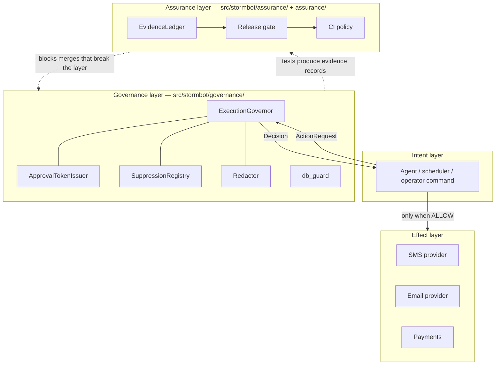
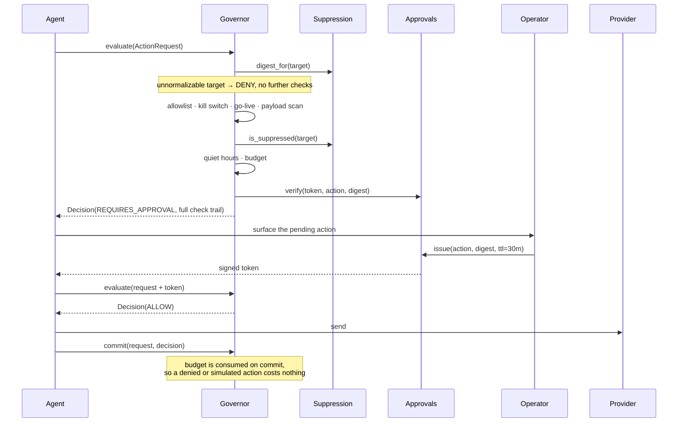

# Architecture

## The problem this shape solves

A revenue-automation agent differs from most software in one way that dominates
every design decision: **its outputs are irreversible and land on people who did
not ask for them.** A bug in a recommendation engine shows someone a bad
suggestion. A bug here texts a stranger at 3am, contacts someone who opted out
last week, or charges a card twice.

Two consequences follow, and they are the two halves of this repository:

1. Every consequential action needs an authorization decision, made in one place,
   that fails closed.
2. Every claim the system makes about that authorization needs to be checkable by
   a machine, because a safety property nobody verifies decays into a comment.

---

## Layering



Two arrows are load-bearing:

**`Decision` returns to the intent layer, not to the effect layer.** The governor
does not call providers. It cannot: it holds no client. The caller performs the
action, and the caller is the only thing that can. That inverts the usual
"middleware wraps the send" design on purpose — a wrapper can be bypassed by
calling the wrapped thing directly, whereas a governor that owns no send path
cannot be bypassed at all, only ignored, and ignoring it is visible in review.

**The dotted arrows close the loop.** Runtime controls generate evidence; the
assurance layer consumes it and blocks changes that would falsify a claim.
Without the return arrow, safety properties rot silently.

---

## Module inventory

### `src/stormbot/governance/` — runtime

| Module | Responsibility | Key property |
| --- | --- | --- |
| [`governor.py`](../../src/stormbot/governance/governor.py) | Ordered decision pipeline over eight checks | Default deny; an exception is a denial |
| [`approvals.py`](../../src/stormbot/governance/approvals.py) | Issue and verify scoped, expiring HMAC approval tokens | The agent runtime cannot mint an approval |
| [`suppression.py`](../../src/stormbot/governance/suppression.py) | Do-not-contact enforcement over keyed digests | No raw identifier is ever stored |
| [`redaction.py`](../../src/stormbot/governance/redaction.py) | Credential and PII detection on egress | Findings never carry the matched value |
| [`db_guard.py`](../../src/stormbot/governance/db_guard.py) | Structural test/production state isolation | Allowlist-shaped, so unknown targets fail closed |

### `src/stormbot/assurance/` — build time

| Module | Responsibility | Key property |
| --- | --- | --- |
| [`evidence.py`](../../src/stormbot/assurance/evidence.py) | The state ladder and the ledger that resolves it | A rung requires an unbroken chain below it |
| [`schema.py`](../../src/stormbot/assurance/schema.py) | Minimal JSON Schema validator | Unsupported keywords raise rather than pass silently |
| [`registry.py`](../../src/stormbot/assurance/registry.py) | Load and type the three registries | A parse failure raises; a schema violation is a verdict |
| [`release_gate.py`](../../src/stormbot/assurance/release_gate.py) | Ten checks, three policies, one report | Exit codes distinguish verdicts from execution failure |
| [`ci_policy.py`](../../src/stormbot/assurance/ci_policy.py) | Verdict × change scope → merge decision | Governed changes without tests block |

---

## The request lifecycle



Two details that look small and are not:

**Budget is spent on `commit`, not on `evaluate`.** Evaluating a request that
turns out to be denied must not consume a real send quota, and neither must a
dry run. Systems that decrement on evaluation drift their quota accounting away
from reality within a day.

**`dry_run` does not change the verdict.** It only suppresses dispatch and
commit. A rehearsal that takes a different path through the checks is not a
rehearsal of anything.

---

## Check ordering

The eight checks run in a fixed order, and the order is not arbitrary — it goes
cheapest-and-most-absolute first, so the trail reads top-down from "this should
never happen" to "this needs a person".

| # | Check | Blocks | Rationale for position |
| --- | --- | --- | --- |
| 1 | `known_action` | ✔ | Default deny. Nothing else matters if the action is not on the allowlist. |
| 2 | `kill_switch` | ✔ | Operator override, above every other consideration including a valid approval. |
| 3 | `go_live_gate` | ✔ | System-wide readiness. Non-consequential actions pass through. |
| 4 | `payload_safety` | ✔ | Content-level, independent of who the recipient is. |
| 5 | `suppression` | ✔ | Recipient-level. Runs before quiet hours because a suppressed contact is never reachable, at any hour. |
| 6 | `quiet_hours` | ✔ | Timing. |
| 7 | `budget` | ✔ | Volume. Last of the blocking checks because it is the most easily changed by policy. |
| 8 | `approval` | ✔ / approval | The only check that can return `REQUIRES_APPROVAL`. Last, so an operator is never asked to approve something that would have been denied anyway. |

The pipeline still runs all eight even after a block. Short-circuiting saves
microseconds and costs an operator a debugging session.

---

## Data model

Three registries under [`assurance/`](../../assurance/), each with a JSON Schema:

```
ai_capabilities.json    what the system can do, its risk tier, and whether a
                        human must be in the loop
product_claims.json     what the system says about itself, pointing at the
                        capabilities and evidence behind each sentence
evidence/*.json         dated proof that a capability reached a state
```

The direction of reference matters. Claims point at capabilities and evidence;
nothing points back. A capability has no idea which claims depend on it, which
means adding a claim cannot silently alter a capability's meaning — and the gate
catches an orphaned capability as an advisory finding rather than letting it sit
unreferenced forever.

---

## Deliberate omissions

This is a reference implementation. It leaves out, on purpose:

| Missing | Why | Consequence |
| --- | --- | --- |
| Persistence | Storage choice is deployment-specific | Budget and suppression state are in-memory; see [ADR-0006](../adr/0006-in-memory-budget-state.md) |
| Concurrency control | Correct answer depends on the deployment topology | Budget counting is not safe across processes |
| HTTP surface | Would add a framework dependency and obscure the logic | The governor is a library, called directly |
| Provider integrations | Every one is a credential and a network dependency | Tests use a recording double |

Each of these is a real limitation, not an oversight, and each is listed here so
a reviewer does not have to discover it as a gotcha.
